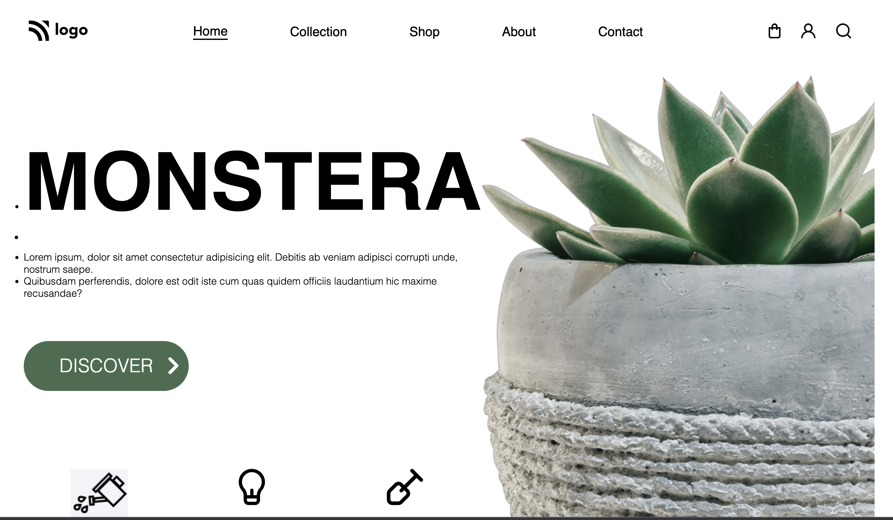

**Plant Homepage**
--------------------------------------
-----------------------------------------
   

[Deployed Link](https://plant-homepage-by-hs.netlify.app/)

What I learned from this Project?

- Learned how to use **HTML** and **CSS** to create a beautiful website.
- Learned building Navbar using CSS Flexbox.
- Learned to implement class selectors properly like :first-child,::after, nth-child and so on for HTML Elements.
- Learned and implemented class, tag based selection of HTML elements.

